# Observability Example

A comprehensive Spring Boot 3 application demonstrating modern observability practices with the complete Grafana Labs stack using OpenTelemetry integration and Java Flight Recorder (JFR) profiling.

## Features

- **Spring Boot 3** with Java 21
- **OpenTelemetry** for instrumentation and data collection
- **Complete Grafana Labs Stack:**
  - **Grafana** - Visualization and dashboards
  - **Mimir** - Metrics storage (Prometheus-compatible)
  - **Loki** - Log aggregation
  - **Tempo** - Distributed tracing
  - **Pyroscope** - Continuous profiling with JFR
- **Grafana Alloy** - Unified observability data collection
- **Java Flight Recorder (JFR)** - Cross-platform profiling
- **Containerized** with Docker Compose

## Architecture

```mermaid
graph TD
    A["🚀 Spring Boot App<br/>localhost:8080"] --> B["📊 Metrics<br/>Micrometer<br/>/actuator/prometheus"]
    A --> C["📝 Logs<br/>Console/File<br/>Docker Container"]
    A --> D["🔍 Traces<br/>OpenTelemetry<br/>OTLP Exporter"]
    A --> P["🔥 Profiling<br/>JFR Agent<br/>Pyroscope Agent"]
    
    B --> E["🔄 Grafana Alloy<br/>localhost:12345"]
    C --> E
    D --> E
    P --> E
    
    E --> F["🏪 Loki<br/>localhost:3100"]
    
    E --> G["📈 Mimir<br/>localhost:9009"]
    E --> H["⚡ Tempo<br/>localhost:3200"]
    E --> Q["🔥 Pyroscope<br/>localhost:4040"]
    
    F --> I["📊 Grafana<br/>localhost:3000"]
    G --> I
    H --> I
    Q --> I
    
    style A fill:#e1f5fe
    style I fill:#f3e5f5
    style E fill:#fff3e0
    style F fill:#e8f5e8
    style G fill:#fff8e1
    style H fill:#fce4ec
    style P fill:#ffebee
    style Q fill:#f3e5f5
```



## Quick Start

### Prerequisites

- Java 21
- Docker and Docker Compose
- Maven (or use the included Maven wrapper)

### Running the Application

1. **Start the observability stack:**
   ```bash
   docker-compose up -d
   ```

2. **Build and run the application:**
   ```bash
   ./mvnw spring-boot:run
   ```

   Or on Windows:
   ```cmd
   mvnw.cmd spring-boot:run
   ```

3. **Access the services:**
   - **Application**: http://localhost:8080
   - **Grafana**: http://localhost:3000 (admin/admin)
   - **Alloy**: http://localhost:12345
   - **Pyroscope**: http://localhost:4040
   - **Tempo**: http://localhost:3200
   - **Loki**: http://localhost:3100
   - **Mimir**: http://localhost:9009

### Testing the Application

Make some requests to generate observability data:

```bash
curl "http://localhost:8080/hello?name=World"
curl "http://localhost:8080/hello?name=OpenTelemetry"
curl "http://localhost:8080/hello?name=Grafana"
```

## Observability Features

### Metrics
- **Custom metrics**: Request counters, response times
- **JVM metrics**: Memory, GC, threads
- **HTTP metrics**: Request/response statistics
- **OpenTelemetry metrics**: Via OTLP protocol

### Logs
- **Structured logging**: JSON format with logback
- **Correlation IDs**: Trace and span IDs in logs
- **Multiple log levels**: INFO, DEBUG, WARN, ERROR
- **Log collection**: Alloy collects Docker container logs
- **Log aggregation**: Via Loki through Alloy

### Traces
- **Distributed tracing**: OpenTelemetry instrumentation
- **Custom spans**: Manual instrumentation examples
- **Trace correlation**: Links to logs and metrics
- **Service maps**: Automatic topology discovery

### Profiling
- **Java Flight Recorder (JFR)**: Cross-platform profiling using Pyroscope Java agent
- **CPU Profiling**: Method-level CPU usage and call stacks
- **Memory Profiling**: Allocation tracking and GC analysis
- **Integration**: Linked with traces and metrics via Grafana
- **Flame graphs**: Performance visualization in Pyroscope

## Configuration

### Application Configuration
Key configuration in `src/main/resources/application.yml`:

```yaml
# OpenTelemetry configuration
otel:
  service:
    name: observability-example
  exporter:
    otlp:
      endpoint: http://localhost:4318
  traces:
    exporter: otlp
  metrics:
    exporter: otlp,prometheus
```

### Alloy Configuration
Located in `observability/alloy/config.alloy`, handles:
- OTLP data reception (traces and metrics)
- Metrics scraping from application
- Profiling data forwarding to Pyroscope
- Data forwarding to backends (Mimir, Tempo, Pyroscope)

### Pyroscope Agent Configuration
Located in `observability/pyroscope-agent/pyroscope-agent.properties`:
- JFR-based profiling configuration
- CPU profiling events
- Data forwarding to Alloy

## Dashboards

Pre-configured Grafana dashboard includes:
- **Request Rate**: Real-time request metrics
- **Response Times**: Percentile-based latency metrics
- **Application Logs**: Searchable log viewer
- **Trace Search**: Distributed trace explorer
- **Service Map**: Application topology
- **Profiling Data**: CPU and memory profiling from Pyroscope

## Development

### Adding Custom Metrics

```java
@Autowired
private MeterRegistry meterRegistry;

Counter customCounter = Counter.builder("custom_metric")
    .description("Description of metric")
    .register(meterRegistry);

customCounter.increment();
```

### Adding Custom Traces

```java
@Autowired
private Tracer tracer;

Span span = tracer.spanBuilder("custom-operation").startSpan();
try (Scope scope = span.makeCurrent()) {
    // Your code here
    span.setAttribute("custom.attribute", "value");
} finally {
    span.end();
}
```

## Troubleshooting

### Common Issues

1. **Port conflicts**: Ensure ports 3000, 3100, 3200, 4040, 8080, 9009, 12345 are available
2. **Docker resources**: Ensure sufficient memory (recommended 4GB+)
3. **Java version**: Application requires Java 21

### Checking Service Health

```bash
# Check all services
docker-compose ps

# Check application health
curl http://localhost:8080/actuator/health

# Check Grafana
curl http://localhost:3000/api/health
```

### Viewing Logs

```bash
# Application logs
docker-compose logs app

# All services logs
docker-compose logs

# Specific service logs
docker-compose logs grafana
docker-compose logs alloy
```

## Technology Stack

- **Java 21**
- **Spring Boot 3.2.1**
- **OpenTelemetry 1.32.0**
- **Grafana 12.1.1**
- **Mimir 2.17.0**
- **Loki 3.5.4**
- **Tempo 2.8.2**
- **Pyroscope 1.4.0**
- **Alloy 1.10.2**
- **Java Flight Recorder (JFR)** - Built-in profiling

## License

This project is for educational purposes demonstrating observability best practices.
