# Observability Architecture

This document describes how our Spring Boot application implements comprehensive observability using the Grafana Lab stack.

## High-Level Architecture

```mermaid
graph TD
    A["🚀 Spring Boot App<br/>localhost:8080"] --> B["📊 Metrics"]
    A --> C["📝 Logs"] 
    A --> D["🔍 Traces"]
    
    B --> E["Micrometer<br/>Prometheus Endpoint<br/>/actuator/prometheus"]
    C --> F["Logback<br/>Loki4j HTTP Appender"]
    D --> G["OpenTelemetry<br/>OTLP Exporter"]
    
    E --> H["🔄 Grafana Alloy<br/>localhost:12345"]
    F --> I["🏪 Loki<br/>localhost:3100"]
    G --> H
    
    H --> J["📈 Mimir<br/>localhost:9009"]
    H --> K["⚡ Tempo<br/>localhost:3200"]
    
    I --> L["📊 Grafana<br/>localhost:3000"]
    J --> L
    K --> L
    
    style A fill:#e1f5fe
    style L fill:#f3e5f5
    style H fill:#fff3e0
```



## Request Flow Sequence


## The Three Pillars of Observability

### 📊 **Metrics**
- **Collection**: Micrometer auto-instruments Spring Boot endpoints, JVM stats
- **Exposure**: `/actuator/prometheus` endpoint in Prometheus format
- **Transport**: Grafana Alloy scrapes metrics every 15 seconds
- **Storage**: Mimir (Prometheus-compatible TSDB)
- **Examples**: `hello_requests_total`, `http_request_duration_seconds`, JVM metrics

### 📝 **Logs** 
- **Collection**: Logback with structured JSON logging
- **Transport**: Loki4j HTTP Appender sends directly to Loki
- **Correlation**: Includes traceId/spanId for linking to traces
- **Storage**: Loki (log aggregation system)
- **Format**: Structured JSON with labels and timestamps

### 🔍 **Traces**
- **Collection**: OpenTelemetry auto-instrumentation via Spring Boot
- **Transport**: OTLP (OpenTelemetry Protocol) via Alloy to Tempo
- **Context**: Automatic HTTP, database, and service call tracing
- **Storage**: Tempo (distributed tracing backend)
- **Features**: Span relationships, timing, baggage propagation

## Key Benefits

1. **🔄 Correlation**: Logs include traceId/spanId for easy correlation with traces
2. **📊 Unified View**: Grafana displays all three pillars in one dashboard
3. **⚡ Real-time**: Direct log shipping, immediate trace forwarding
4. **🏗️ Scalable**: Alloy can handle multiple applications
5. **🔍 Rich Context**: Complete request journey from metrics to traces to logs

## Access Points

- **Application**: http://localhost:8080/hello?name=Test
- **Grafana Dashboard**: http://localhost:3000 (admin/admin)
- **Metrics**: http://localhost:8080/actuator/prometheus
- **Logs**: http://localhost:3100 (Loki)
- **Traces**: http://localhost:3200 (Tempo)
- **Alloy**: http://localhost:12345 (collector)

## Current Status

✅ **Metrics**: Working perfectly - Alloy scraping from app, forwarding to Mimir  
✅ **Logs**: Working perfectly - Direct HTTP appender to Loki with trace correlation  
✅ **Traces**: Working perfectly - OpenTelemetry OTLP to Tempo via Alloy  
❌ **Profiling**: Disabled due to Windows compatibility issues with Pyroscope agent

## Profiling Implementation Notes

The project includes the **correct** Pyroscope agent integration approach, but it's commented out due to Windows compatibility issues:

### Proper Pyroscope Integration (Currently Commented Out)

```java
// Required dependency in pom.xml:
<dependency>
    <groupId>io.pyroscope</groupId>
    <artifactId>agent</artifactId>
    <version>0.13.0</version>
</dependency>

// Configuration in PyroscopeConfig:
Config config = new Config.Builder()
    .setApplicationName(applicationName)
    .setServerAddress(serverAddress)
    .build();

PyroscopeAgent.start(config);
```

### Why This Approach is Correct

This provides **real continuous profiling** with:
- Statistical sampling at high frequency (100Hz)
- Call stack sampling during CPU work
- Flame graph generation showing method timing
- Memory allocation profiling
- Wall clock time profiling
- Integration with async-profiler for maximum accuracy

### Windows Compatibility Issue

The Pyroscope Java agent uses async-profiler internally, which doesn't support Windows. Error:
```
java.lang.RuntimeException: Unsupported OS Windows 10
```

### Alternative Solutions

1. **Linux/macOS Environment**: Use the proper agent-based approach
2. **Java Flight Recorder (JFR)**: Enable JFR and manually upload files to Pyroscope
3. **Development Only**: Keep profiling disabled for Windows development
