# Observability Architecture

This document describes how our Spring Boot application implements comprehensive observability using the Grafana Lab stack.

## High-Level Architecture

```mermaid
graph TD
    A["🚀 Spring Boot App<br/>localhost:8080"] --> B["📊 Metrics"]
    A --> C["📝 Logs"] 
    A --> D["🔍 Traces"]
    A --> P["🔥 Profiling<br/>JFR Agent"]
    
    B --> E["Micrometer<br/>Prometheus Endpoint<br/>/actuator/prometheus"]
    C --> F["Console/File<br/>Docker Container"]
    D --> G["OpenTelemetry<br/>OTLP Exporter"]
    P --> H["Pyroscope Agent<br/>JFR Profiling"]
    
    E --> I["🔄 Grafana Alloy<br/>localhost:12345"]
    F --> I
    G --> I
    H --> I
    
    I --> J["🏪 Loki<br/>localhost:3100"]
    
    I --> K["📈 Mimir<br/>localhost:9009"]
    I --> L["⚡ Tempo<br/>localhost:3200"]
    I --> M["🔥 Pyroscope<br/>localhost:4040"]
    
    J --> N["📊 Grafana<br/>localhost:3000"]
    K --> N
    L --> N
    M --> N
    
    style A fill:#e1f5fe
    style N fill:#f3e5f5
    style I fill:#fff3e0
    style P fill:#ffebee
    style M fill:#f3e5f5
```



## Request Flow Sequence


## The Four Pillars of Observability

### 📊 **Metrics**
- **Collection**: Micrometer auto-instruments Spring Boot endpoints, JVM stats
- **Exposure**: `/actuator/prometheus` endpoint in Prometheus format
- **Transport**: Grafana Alloy scrapes metrics every 15 seconds
- **Storage**: Mimir (Prometheus-compatible TSDB)
- **Examples**: `hello_requests_total`, `http_request_duration_seconds`, JVM metrics

### 📝 **Logs** 
- **Collection**: Logback with structured JSON logging to console/file
- **Transport**: Alloy collects Docker container logs via Docker socket
- **Correlation**: Includes traceId/spanId for linking to traces
- **Storage**: Loki (log aggregation system) via Alloy
- **Format**: Structured JSON with labels and timestamps

### 🔍 **Traces**
- **Collection**: OpenTelemetry auto-instrumentation via Spring Boot
- **Transport**: OTLP (OpenTelemetry Protocol) via Alloy to Tempo
- **Context**: Automatic HTTP, database, and service call tracing
- **Storage**: Tempo (distributed tracing backend)
- **Features**: Span relationships, timing, baggage propagation

### 🔥 **Profiling**
- **Collection**: Java Flight Recorder (JFR) via Pyroscope Java agent
- **Transport**: Pyroscope agent sends JFR data to Alloy, then to Pyroscope
- **Types**: CPU profiling, memory allocation, thread analysis
- **Storage**: Pyroscope (continuous profiling backend)
- **Features**: Flame graphs, method-level performance analysis, cross-platform

## Key Benefits

1. **🔄 Correlation**: Logs include traceId/spanId for easy correlation with traces
2. **📊 Unified View**: Grafana displays all four pillars in one dashboard
3. **⚡ Real-time**: Direct log shipping, immediate trace forwarding, continuous profiling
4. **🏗️ Scalable**: Alloy can handle multiple applications
5. **🔍 Rich Context**: Complete request journey from metrics to traces to logs to profiling
6. **🔥 Cross-platform Profiling**: JFR works on Windows, Linux, and macOS

## Access Points

- **Application**: http://localhost:8080/hello?name=Test
- **Grafana Dashboard**: http://localhost:3000 (admin/admin)
- **Metrics**: http://localhost:8080/actuator/prometheus
- **Logs**: http://localhost:3100 (Loki)
- **Traces**: http://localhost:3200 (Tempo)
- **Profiling**: http://localhost:4040 (Pyroscope)
- **Alloy**: http://localhost:12345 (collector)
- **Mimir**: http://localhost:9009 (metrics storage)

## Current Status

✅ **Metrics**: Working perfectly - Alloy scraping from app, forwarding to Mimir  
✅ **Logs**: Working perfectly - Direct HTTP appender to Loki with trace correlation  
✅ **Traces**: Working perfectly - OpenTelemetry OTLP to Tempo via Alloy  
✅ **Profiling**: Working perfectly - JFR-based profiling via Pyroscope agent to Alloy to Pyroscope

## Profiling Implementation

The project uses **Java Flight Recorder (JFR)** via the Pyroscope Java agent for cross-platform profiling:

### Current JFR Implementation (Working)

**Configuration in `observability/pyroscope-agent/pyroscope-agent.properties`:**
```properties
pyroscope.application.name=observability-example
pyroscope.server.address=http://alloy:4041
pyroscope.profiler.type=JFR
pyroscope.format=jfr
pyroscope.profiler.event=cpu
pyroscope.profiling.interval=30s
pyroscope.upload.interval=30s
pyroscope.labels=env=dev,service=observability-example
```

**Docker Compose Integration:**
```yaml
app:
  # ... other configuration
  command: [
    "java",
    "-javaagent:/app/pyroscope-javaagent.jar",
    "-Dpyroscope.config.file=/app/pyroscope-agent.properties",
    "-jar", "/app/app.jar"
  ]
  volumes:
    - ./observability/pyroscope-agent/pyroscope-agent.properties:/app/pyroscope-agent.properties
```

### Why JFR is the Right Choice

This provides **real continuous profiling** with:
- **Cross-platform**: Works on Windows, Linux, and macOS
- **Low overhead**: Less than 1% performance impact
- **Built-in**: No external dependencies required
- **CPU profiling**: Method-level CPU usage and call stacks
- **Memory profiling**: Allocation tracking and GC analysis
- **Thread analysis**: Lock contention and thread performance
- **Integration**: Seamless integration with Pyroscope for visualization

### Data Flow

1. **JFR Collection**: Pyroscope agent collects JFR data from the JVM
2. **Data Processing**: Agent processes JFR data into Pyroscope format
3. **Transport**: Agent sends data to Alloy on port 4041
4. **Forwarding**: Alloy forwards profiling data to Pyroscope
5. **Storage**: Pyroscope stores and indexes the profiling data
6. **Visualization**: Grafana queries Pyroscope for flame graphs and analysis
